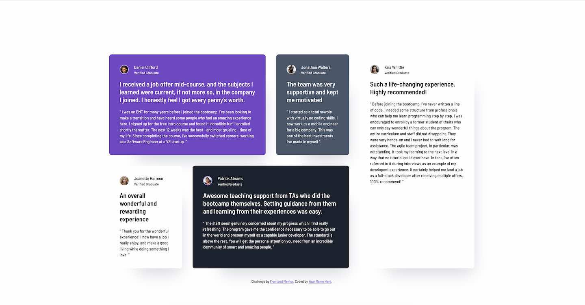

# Frontend Mentor - Testimonials grid section solution

This is a solution to the [Testimonials grid section challenge on Frontend Mentor](https://www.frontendmentor.io/challenges/testimonials-grid-section-Nnw6J7Un7). Frontend Mentor challenges help you improve your coding skills by building realistic projects.

## Table of contents

- [Overview](#overview)
  - [The challenge](#the-challenge)
  - [Screenshot](#screenshot)
  - [Links](#links)
- [My process](#my-process)
  - [Built with](#built-with)
  - [Useful resources](#useful-resources)
- [Author](#author)

## Overview

### The challenge

Users should be able to:

- View the optimal layout for the site depending on their device's screen size

### Screenshot

### Links

- Solution URL: [Add solution URL here](https://github.com/psegarel/fem-testimonials-grid)
- Live Site URL: [Add live site URL here](https://psegarel.github.io/fem-testimonials-grid/)

### Built with

- Semantic HTML5 markup
- CSS custom properties
- Flexbox
- CSS Grid
- Mobile-first workflow

### Useful resources

- [Responsively App](https://responsively.app/) - A must-have DevTool for all web developers that will make your job easier. And it's free and open source too!
- [Trae](https://www.trae.ai/) - Trae is an adaptive AI IDE that transforms how you work, collaborating with you to run faster.

## Author

- Website - [Add your name here](https://patrick-segarel.com)
- Frontend Mentor - [@yourusername](https://www.frontendmentor.io/profile/psegarel)
